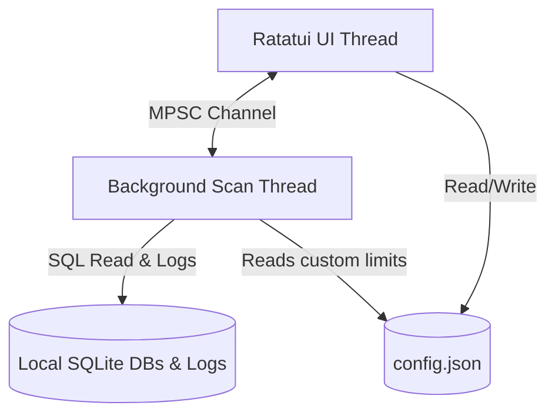

# QuotaChecker-TUI 📊

[](https://crates.io/crates/quotachecker-tui)
[](https://crates.io/crates/quotachecker-tui)
[](https://www.rust-lang.org/)
[](LICENSE)

> A terminal-based real-time dashboard designed to monitor local AI coding agents, track API requests, count token usage, and estimate cumulative costs directly from your terminal.

---

## 🔍 Overview

**QuotaChecker-TUI** is a lightweight, responsive terminal user interface (TUI) built with [Ratatui](https://ratatui.rs) and [Crossterm](https://github.com/crossterm-rs/crossterm). It operates entirely locally by spawning a background thread to safely query the local telemetry databases and logs of active AI tools (Codex, OpenCode, Agy, Zed) without blocking the UI thread.

---

## ✨ Key Features

- **⚡ Asynchronous Scanning**: Periodic system scanning executes in a background thread utilizing SQLite busy timeouts (`500ms`) to prevent database write locks on active AI tools.
- **🏷️ Smart Tier-Based Quotas**: Automatically detects the active authentication state and user tier (e.g., Enterprise vs Personal) of your AI tools to apply exact quota limits.
- **📈 Proportional Model Distribution**: Distributes overall quota budgets among individual LLM models using proportional ratios defined by the active tier.
- **⚙️ Custom Overrides**: Allows the user to configure custom quota limits directly from the TUI, dynamically adjusting model limits proportionally.
- **🎨 Modern TUI Aesthetics**: Supports multiple premium styling themes (Cyan, Purple, Emerald, Amber, Monochrome) with full support for terminal transparency (uses `Color::Reset` for backgrounds).

---

## 🛠️ Supported Agents

| Agent | Local Data Source | Monitored Metrics | Quota Reset Freq |
| :--- | :--- | :--- | :--- |
| 💻 **Codex** | `~/.codex/state_5.sqlite` | Sessions, requests, tokens | Daily |
| 🛡️ **OpenCode** | `~/.local/share/opencode/opencode.db` | Sessions, requests, tokens, spent cost | Monthly |
| 🤖 **Agy** | `~/.gemini/antigravity-cli/log/` | CLI prompts, command logs | Weekly |
| 🎨 **Zed** | `~/.local/share/zed/threads/threads.db` | Active assistant threads | Daily |

---

## 🚀 Installation

### From crates.io (Recommended)
Install the binary directly from crates.io using Cargo:
```bash
cargo install quotachecker-tui
```

### From Git
```bash
cargo install --git https://github.com/julesklord/quotachecker-tui
```

### From Source
Compile and install from source manually:
```bash
git clone https://github.com/julesklord/quotachecker-tui.git
cd quotachecker-tui
cargo build --release
# The compiled binary is located at ./target/release/quotachecker-tui
```

---

## ⌨️ Usage

Run the dashboard from your terminal:
```bash
quotachecker-tui
```

### Keybindings

| Key | Action |
| :--- | :--- |
| `Tab` / `←` `→` | Switch between tabs |
| `↑` `↓` | Navigate list items |
| `s` | Modify global quota limit for the selected agent |
| `+` / `-` or `l` / `h` | Adjust option values in the Settings tab |
| `Enter` | Confirm and save modal inputs |
| `Esc` | Cancel / close modal |
| `r` | Force-trigger an immediate background telemetry scan |
| `q` / `Ctrl+c` | Safe application exit |

### Dashboard Tabs

1. **📊 Overview** — Shows spent costs, total tokens, and request counts aggregated across all coding assistants.
2. **🤖 AI Agents** — Detailed dashboard per agent showing version, configuration paths, active tier, and model usage breakdown.
3. **🕒 Sessions** — Chronological telemetry logs and historical thread details.
4. **📉 Quotas** — Displays usage bar gauges alongside configured warning thresholds (Soft/Hard limits).
5. **⚙️ Settings** — Customize app preferences, refresh rate, theme accents, and threshold limits.

---

## ⚙️ Configuration

The application stores its configuration file at `~/.config/quotachecker-tui/config.json` (or the equivalent config directory for your OS).

### Configuration Schema Example

```json
{
  "refresh_rate_ms": 2000,
  "soft_limit_percent": 80.0,
  "hard_limit_percent": 100.0,
  "theme": "Cyan",
  "codex_quota": {
    "limit": 200,
    "custom": false
  },
  "opencode_quota": {
    "limit": 1000,
    "custom": false
  },
  "agy_quota": {
    "limit": 500,
    "custom": false
  },
  "zed_quota": {
    "limit": 300,
    "custom": false
  },
  "model_limits": {
    "gpt-5": 50,
    "gpt-4.1": 100,
    "claude-4.7": 150
  }
}
```

### Parameter Explanations
- `refresh_rate_ms`: How frequently (in milliseconds) the background scanner thread queries local data sources.
- `soft_limit_percent`: Usage percentage at which gauges turn amber to warn the user.
- `hard_limit_percent`: Usage percentage at which gauges turn red indicating the quota limit is reached.
- `custom`: If set to `true`, the scanner respects the custom `limit` set by the user instead of overriding it with the default tier limits.

---

## 🏗️ Architecture



- **Background Scanning**: Scans are performed asynchronously on a dedicated thread to ensure zero UI freezes.
- **In-Memory Cache**: The config is loaded into an `Arc<RwLock<AppConfig>>` allowing instant lookups and writes.
- **Exec Cache**: Utilizes a `OnceLock<Mutex<HashMap>>` cache for CLI path checks (`which`) and version execution lookups.
- **Panic Protection**: A custom panic hook automatically catches unexpected failures to safely restore the raw terminal state on crash.

---

## 🛠️ Development & Quality Controls

We enforce strict Rust style and quality policies:

```bash
cargo test        # Run the full test suite
cargo clippy      # Run Clippy lints to check code quality
cargo fmt         # Format files following rustfmt rules
```

---

## 📚 Reference Docs

- [Architecture Design & ADRs](docs/wiki/architecture.md)
- [Agent SOP Guide](docs/wiki/agent-sop.md)
- [Development Guidelines](docs/wiki/development.md)
- [Hygiene Standards](docs/wiki/hygiene.md)

---

## 📄 License

Distributed under the MIT License. See [LICENSE](LICENSE) for details.